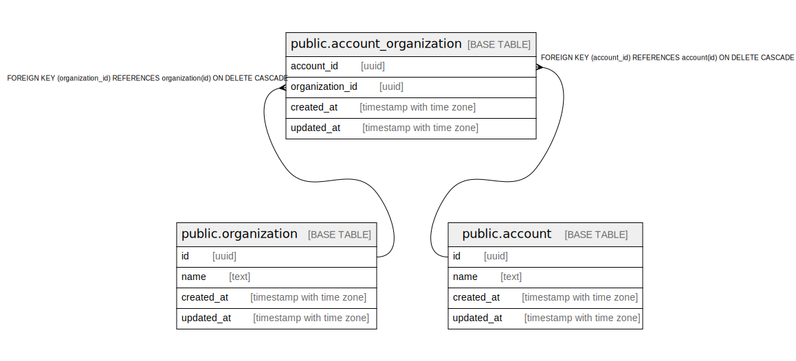

# app

## Tables

| Name | Columns | Comment | Type |
| ---- | ------- | ------- | ---- |
| [public.organization](public.organization.md) | 4 |  | BASE TABLE |
| [public.account](public.account.md) | 4 |  | BASE TABLE |
| [public.account_organization](public.account_organization.md) | 4 |  | BASE TABLE |

## Relations

---

> Generated by [tbls](https://github.com/k1LoW/tbls)
