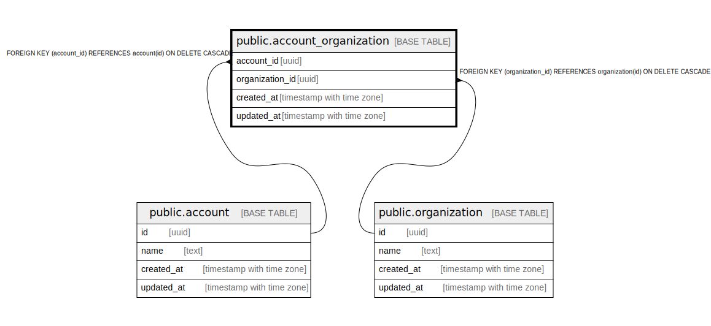

# public.account_organization

## Description

## Columns

| Name | Type | Default | Nullable | Children | Parents | Comment |
| ---- | ---- | ------- | -------- | -------- | ------- | ------- |
| account_id | uuid |  | false |  | [public.account](public.account.md) |  |
| organization_id | uuid |  | false |  | [public.organization](public.organization.md) |  |
| created_at | timestamp with time zone | CURRENT_TIMESTAMP | false |  |  |  |
| updated_at | timestamp with time zone | CURRENT_TIMESTAMP | false |  |  |  |

## Constraints

| Name | Type | Definition |
| ---- | ---- | ---------- |
| fk_organization_account_organization | FOREIGN KEY | FOREIGN KEY (organization_id) REFERENCES organization(id) ON DELETE CASCADE |
| fk_account_account_organization | FOREIGN KEY | FOREIGN KEY (account_id) REFERENCES account(id) ON DELETE CASCADE |
| account_organization_pkey | PRIMARY KEY | PRIMARY KEY (account_id, organization_id) |

## Indexes

| Name | Definition |
| ---- | ---------- |
| account_organization_pkey | CREATE UNIQUE INDEX account_organization_pkey ON public.account_organization USING btree (account_id, organization_id) |
| idx_account_organization_organization_id | CREATE INDEX idx_account_organization_organization_id ON public.account_organization USING btree (organization_id) |

## Relations

---

> Generated by [tbls](https://github.com/k1LoW/tbls)
