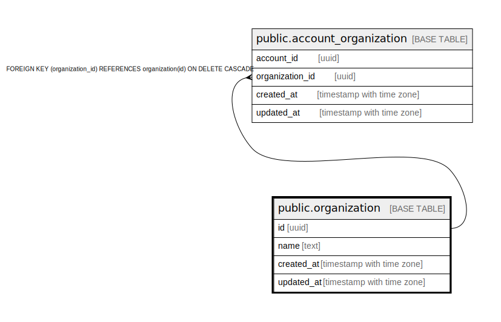

# public.organization

## Description

## Columns

| Name | Type | Default | Nullable | Children | Parents | Comment |
| ---- | ---- | ------- | -------- | -------- | ------- | ------- |
| id | uuid | gen_random_uuid() | false | [public.account_organization](public.account_organization.md) |  |  |
| name | text |  | false |  |  |  |
| created_at | timestamp with time zone | CURRENT_TIMESTAMP | false |  |  |  |
| updated_at | timestamp with time zone | CURRENT_TIMESTAMP | false |  |  |  |

## Constraints

| Name | Type | Definition |
| ---- | ---- | ---------- |
| organization_pkey | PRIMARY KEY | PRIMARY KEY (id) |
| organization_name_key | UNIQUE | UNIQUE (name) |

## Indexes

| Name | Definition |
| ---- | ---------- |
| organization_pkey | CREATE UNIQUE INDEX organization_pkey ON public.organization USING btree (id) |
| organization_name_key | CREATE UNIQUE INDEX organization_name_key ON public.organization USING btree (name) |

## Relations

---

> Generated by [tbls](https://github.com/k1LoW/tbls)
